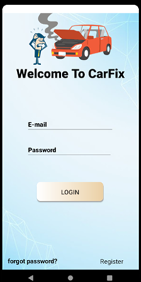
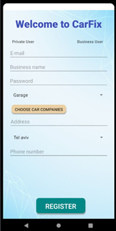
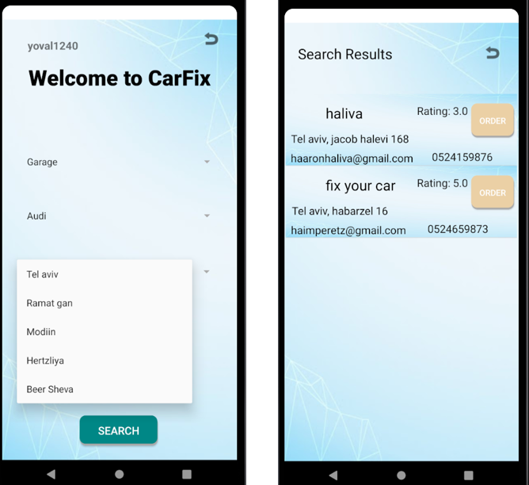

## Finding a mechanic has never been easier

CarFix is an app that connects vehicle owners to automotive professionals. CarFix enables connection in 2 types of users: a private customer (car owner) and a business customer (car service provider) and allows a private customer to search by criteria, view the business profile and schedule treatment online, conveniently and quickly.
The user will be able to receive a reminder on the phone about an hour before the treatment hour and at the end he will be able to rate the business owner according to his level of satisfaction.
In addition, at the end of the treatment the business owner will be able to specify the treatment details and what is done in the queue in the app. The queue will be kept in the care history of the vehicle owner and the business owner and will be available for future viewing from each user's home page.

## Application development
The application developed in Android studio and FireBase database to save the object and the information of the application.

## App walkthrough

### Registration
* In the login page press button register in the right button. 
* Choose the kind of user you want to register with. 
* Fill the fields with your information.

  

### Private user
After login, the private user transfered to his profile screen.
Private user can perform several actions:
1. Editing a personal profile.
2. Viewing upcoming appointments. 
3. Rating the business.

more functions:
1. press on business phone number and the application move you to the dialer.

2. press on set notification, the application set notifiaction one hour before the appointment.

### Business user
After login, the business user transfered to his profile screen.
Business user can perform several actions:
1. View upcoming queues - work schedule.
2. Edit business profile.
3. Leave the description of the service provided in the same queue - the description will be stored in a queue in DB for both users and will be updated on the home screens.

## Main Functionality
### Search
The user will be able to perform a search of his choice.

The system will display the businesses that meet the search results with:
1. contact information.
2. an average rating determined by customers who used the services of that business.
3. button through which he can enter the business page and book an appointment.

### Book a treatment
The user will be able to book an appointment on the available dates and hours displayed in the calendar and the time wheel. 
Once scheduled, it will be saved in the DB of both users and displayed on the home pages of both.

## Databse
In the project we use FireBase database to store all the information of the application.
The databse is designed with 3 objects as shown in the picture below.

